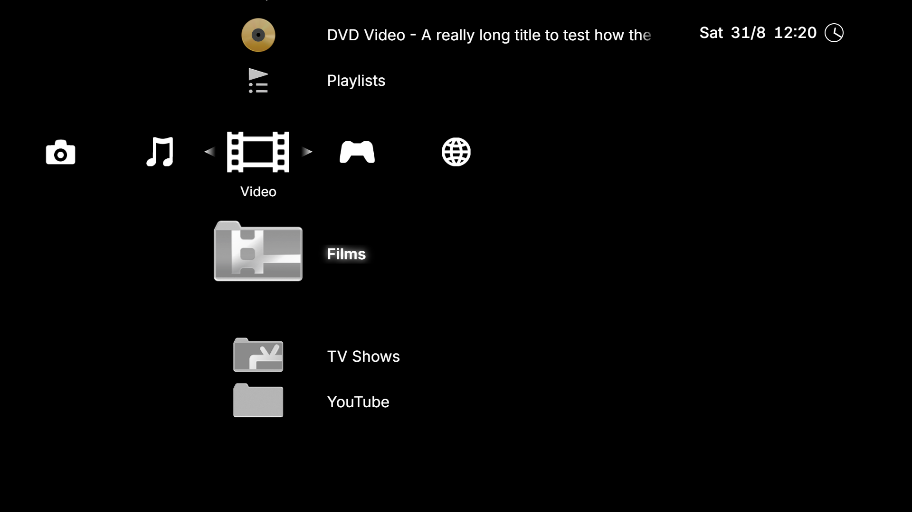
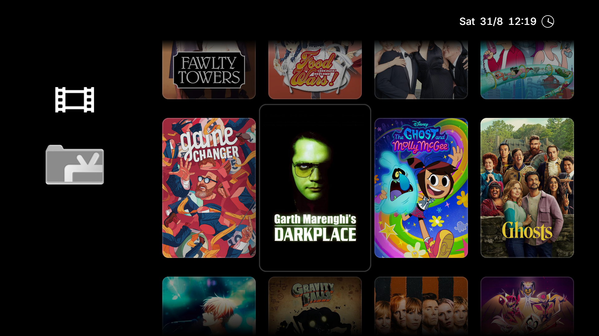
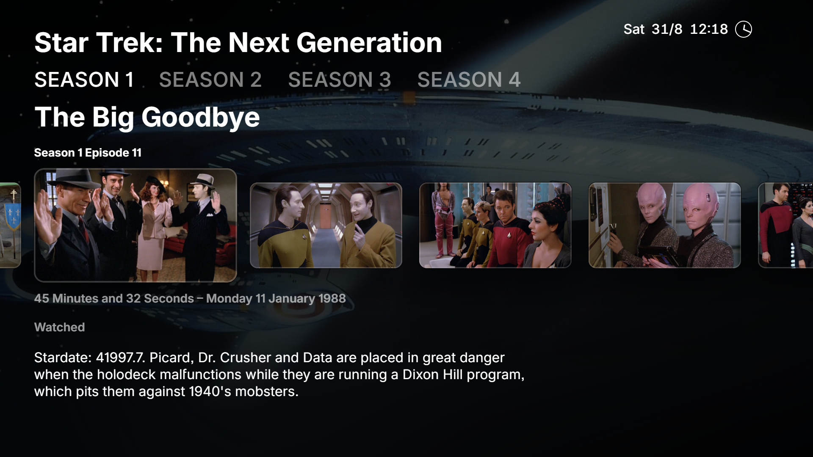
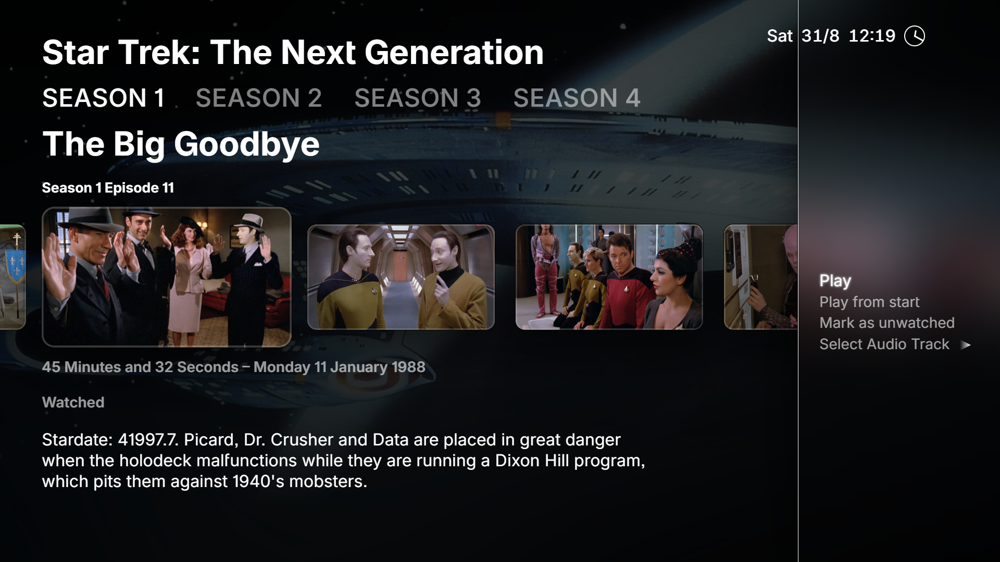
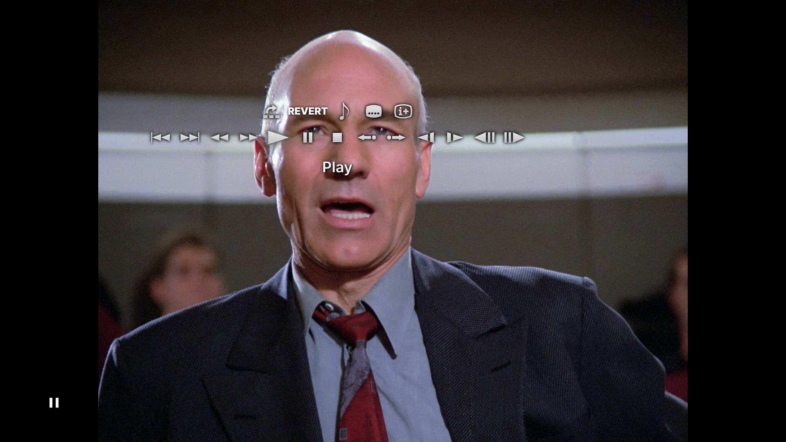
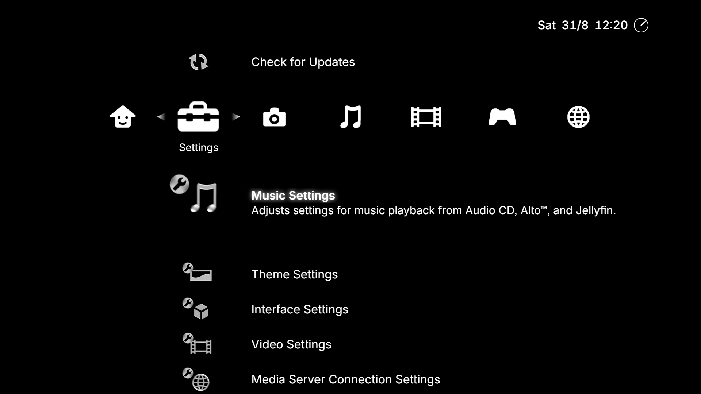
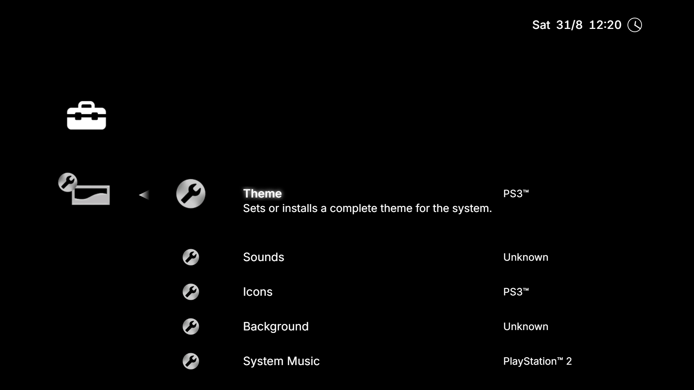

# Tellyfin

> [!NOTE]
> [2025-03-27] Development is still on-going! In the coming weeks I will be pushing the new plugin system to the repository! Things are still a bit janky with it, for example the Add Media Server wizard needs support for more flexible authentication options, but the proof-of-concept Jellyfin plugin has been working just-about flawlessly on my personal system for the last month or so.

> [!NOTE]
> Additional: I am still running Jellyfin `10.9`, so currently Tellyfin doesn't work with `10.10`. Due to the plugin system, support for multiple versions of Jellyfin should be possible. Therefore, before the plugin system is published to the repository I will be creating a `10.9` and `10.10` version of the Jellyfin plugin.

The goal for this is a PS3-style UI for films, TV shows, music, photos, emulators, and Steam (social features possibly included too... maybe).

## Cloning

```sh
# Clone main repository.
git clone git@github.com:ILikeTeaALot/Tellyfin.git
# Pull submodules (open an issue if you get an access/permission error.)
git submodule update --init --recursive
# JS dependencies
pnpm install
```

> [!WARNING]
> Tellyfin is **very** early in development. It also only works on Windows at this time.
>
> READ THIS BEFORE ATTEMPTING TO RUN Tellyfin/VSH

> [!NOTE]
> To add a Jellyfin server, go to [Settings] › [Media Server Connection Settings] › [Add Media Server Connection] and fill in the name, address, and login details for the server. To remove one, go to [Settings] › [Media Server Connection Settings] › [Remove Media Server Connection] and select the server from the list that you wish to remove.

# Current Status

## TLDR

### Done

- [x] Local file playback
- [x] DVD (and theoretically Blu-ray) playback
- [x] Jellyfin Library discovery
	- [x] Some Jellyfin library browsing (see below)
- [x] Some parts of Themes (see below)
- [x] Server Connection Setup
- [x] Settings

### Still To-do

- [ ] Music Playback
	- [ ] CD
	- [ ] Jellyfin
- [ ] Photo viewing
- [ ] Live TV
- [ ] Themes
	- [x] Indexing themes
	- [x] Reading icons from themes
	- [ ] Loading audio feedback samples from themes
- [ ] Photos
- [ ] Jellyfin
	- [ ] Content browsing
		- [x] TV Shows and Series
		- [x] Films
		- [x] Music
		- [ ] Photos
		- [ ] Live TV
- [ ] Steam
	- [ ] Library detection
	- [ ] Game launching
	- [x] Switching back-and-forth between Steam and Tellyfin (see the README in `crates/start-tellyfin`).
- [ ] Emulators
- [ ] Plug-in architecture(s) (which kind(s) to use is still undecided.)
	- [ ] Daemon/IPC
	- [ ] DLL
	- [ ] Lua/Scheme
	- [ ] Node module

## Details

At present, playback and playback-control of media works, selected by browsing one or more Jellyfin servers (see note just below).

> [!NOTE]
> To add a Jellyfin server, go to [Settings] › [Media Server Connection Settings] › [Add Media Server Connection] and fill in the name, address, and login details for the server. To remove one, go to [Settings] › [Media Server Connection Settings] › [Remove Media Server Connection] and select the server from the list that you wish to remove.

The User Interface design is a top-level interface based on the [XMB](https://en.wikipedia.org/wiki/XrossMediaBar), which navigates to a hybrid of vertical lists, grids, single-option landing pages (i.e. 1 option: *Play*), and a contiuous row of episodes for TV shows. Eventually the top-level menu will support navigating:

 - Multiple Jellyfin servers
 - Alto integration (the XMB works quite well as a GUI for Music)
 - Emulators/RetroArch
 - Steam
 - Navigable Settings (DONE - Mostly)

> [!NOTE]
> The layout of the UI also only works properly at 1920x1080. To use at 4K, set the zoom to 200%; everything should work correctly\*.
>
> \*Other than image resolution. That's hardcoded too and may result in a small amount of artifacting at 4K.

## Screenshots

### Video Category



### TV Shows List



### Show Info/Episodes



#### Menu



### Video Controls



### Settings



### Settings List



(More screenshots available in `.README/screenshots`)

## Requirements

1. A working Rust toolchain for compilation.
2. Node.js v20 or newer + PNPM (other package managers *might* work).
3. [libmpv](#libmpv).
3. [BASS](#BASS).
4. A running Jellyfin server.

### libmpv

Download libmpv from [here](https://sourceforge.net/projects/mpv-player-windows/files/).

In order to run the application, you will need a copy of `mpv.dll` and `mpv.lib` (Rename `mpv.dll.a` to `mpv.lib`, because the GNU toolchain is a bit funky on Windows.)

If you have one of the following CPUs, download the latest `libmpv/mpv-dev-x86_64-v3-[date]-git-xxx.7z` (note the `v3` in the name):

Intel: Haswell or newer with AVX2 (September 2013 - Present)
or Atom "Gracemont" or newer (Nov 2021 - Present)

AMD: "Excavator" or any Ryzen CPU (c. June 2015 - Present)

If you do not have one of the above CPUs, download the latest `libmpv/mpv-dev-x86_64-[date]-git-xxx.7z`

If you plan on playing DVDs, you will also need `libdvdcss`.

### BASS

Go to [Un4Seen.com](https://www.un4seen.com/bass.html) and download the Win32 version of BASS and the following add-ons:

Official Non-Codec Addons

 - BASSmix !IMPORTANT
 - BASSCD
 - BASSloud
 - BASSWASAPI

Official Codecs

 - BASSALAC
 - BASSAPE
 - BASSDSD
 - BASSFLAC
 - BASSHLS
 - BASSOPUS
 - BASSWEBM
 - BASSWV

Third Party

 - BASS_MPC

They're not all currently actively used, but BASS is planned to form the backbone of music playback so they will be required for wide format support.